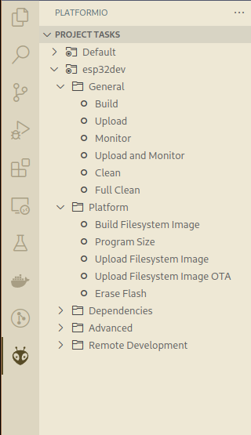
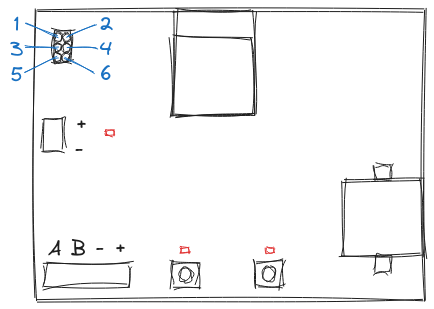
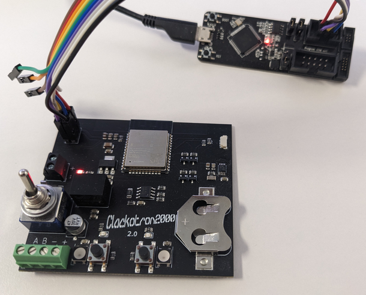
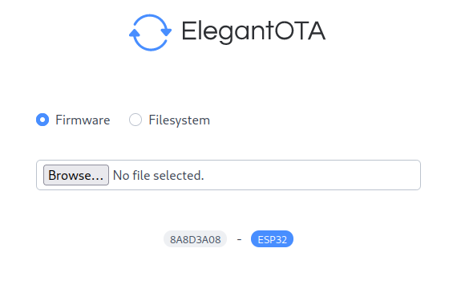
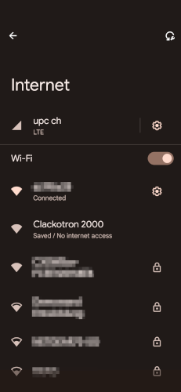
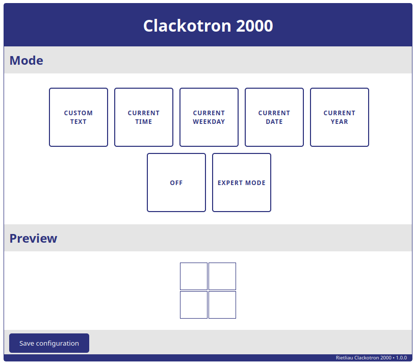

{: .cover}

# Clackotron 2000 User Manual
This user manual covers the whole process of building and programming a device. If you have bought a completed, pre-programmed PCB or Clackotron assembly, you may skip to the [Setup](#setup) step below.

# Hardware
## Obtaining the hardware
...

## Hardware overview
The following sketch describes the most important features of the hardware:

ID | Description
--- | ---
`(1)` | 30V DC input from power supply.
`(2)` | 30V DC +/- and RS485 A/B line output to modules.
`(3)` | Mode button - Hold >5s to activate configuration mode.
`(4)` | Reset button - Hold >10s to reset all settings on the device.
`(5)` | Power LED - Lights up as soon as device is powered with 30V DC.
`(6)` | Mode LED - Lights up when in configuration mode.
`(7)` | Reset LED - Lights up shortly when reset was accepted.
`(8)` | Battery holder for real time clock (RTC) to keep time.

## Wiring the hardware

{: .warning }
**Always** disconnect your power supply before working on the hardware and/or wiring components!

There are two things that don't come with the Clackotron 2000 hardware. The 30V DC power supply (PSU) and the SBB split flap modules. As such, the harware has connectors for wiring to these components.

The following diagram shows the wiring of a Clackotron 2000 assembly with the hardware. 

ID | Description
--- | ---
`(1)` | Connect the output of a 30V DC PSU to the `+` and `-` terminals of the input of the Clackotron 2000 hardware. The input is reverse polarity protected, so if you accidentally switch the wires, the Clackotron 2000 will simply not work instead of going up in smoke.
`(2)` | Connect the `+`, `-`, `A` and `B` terminals of the Clackotron 2000 output to your SBB split flap modules. The terminals are labelled on both the Clackotron 2000 PCB as well as the SBB split flap display PCBs, so it should be easy to figure out which wire goes where.
`(3)` | Connect the input of your 30V DC PSU to whatever input it takes (most likey 230V AC) and your Clackotron 2000 will be running.

# Software
## Building or downloading webinterface
For most use-cases, you will want the webinterface to be available on the device. The webinterface is available in the [clackotron/clackotron_webinterface](https://github.com/clackotron/clackotron_webinterface) repository and is written to the device as part of the LittleFS file system, which is then served by the internal HTTP server as static files.

### Using prebuilt webinterface
If you don't want to make changes to the webinterface and use it as-is (recommended for most users), download the latest release from the [release page](https://github.com/clackotron/clackotron_webinterface/releases) and put the contents into the `data` directory in the `clackotron_firmware` repository.

### Building webinterface on your own
If you want to make changes to the webinterface or compile it from source for any other reason, clone the repository and build it:
1. `git clone https://github.com/clackotron/clackotron_webinterface.git`
2. `cd clackotron_webinterface`
3. `npm install` _# Install dependencies_
4. `npm run build` _# Build the webinterface_

This will generate the following files (`000000` will be a different string on each build):
* `dist/index.html`
* `dist/favicon.ico`
* `dist/assets/index.000000.css`
* `dist/assets/index.000000.js`

Copy the contents of the `dist` directory over to the `data` directory in the `clackotron_firmware` repository. The `data` directory should then contain the `index.html`, `favicon.ico`, `assets` directory and `config` directory.

## Building and uploading firmware
The [clackotron/clackotron_firmware](https://github.com/clackotron/clackotron_firmware) repository contains the whole source code for the ESP32/Arduino firmware that runs on the Clackotron 2000. The easiest way to work with the firmware is to use VSCode with the [PlatformIO](https://platformio.org/install/ide?install=vscode) extension.

1. `git clone https://github.com/clackotron/clackotron_firmware.git`
2. `cd clackotron_firmware`
3. `code .` _# Open in VS Code_

Of course, you may use any other way of running the PlatformIO project, if you're already familiar with a different workflow.

In VS Code, the PlatformIO extension will automatically detect the `platformio.ini` and offer you the possibility to perform all the required actions.

{: .bordered}

Connect the Clackotron Hardware with the pinout shown below and then run `Platform > Upload Filesystem Image` and `General > Upload`. After this, the device will be ready to go.

Pin | Description
--- | ---
1 | TXD0
2 | +3.3V
3 | IO0
4 | RXD0
5 | EN
6 | GND

{: .bordered}

If it is not behaving as expected, use the `General > Upload and Monitor` option to get the serial log from the device for further debugging.

## Uploading a firmware update
The Clackotron 2000 uses [ayushsharma82/ElegantOTA](https://github.com/ayushsharma82/ElegantOTA) to allow the user to upload firmware and filesystem updates.

When the configuration mode is activated (hold mode button for >5s until LED lights up), the update page can be accessed at `http://clackotronip:8080/update`.

When building the software from the `clackotron_firmware` repository, the following are generated:
* `.pio/build/esp32dev/firmware.bin`
* `.pio/build/esp32dev/littlefs.bin`

The ElegantOTA page allows the user to upload a `firmware.bin` when selecting `Firmware` and a `littlefs.bin` when selecting `Filesystem`.

{: .warning}
Make sure the correct update type is selected, otherwise the device might not be bootable anymore until flashed via serial connection.
# Setup
## Connecting to your home WiFi network
The Clackotron 2000 uses the [WiFi manager](https://github.com/tzapu/WiFiManager) library to allow the user to easily connect it to an existing WiFi network. When the Clackotron 2000 is first started (or no WiFi network has been configured yet), it will create a WiFi hotspot called `Clackotron2000`.

{: .bordered}

You can connect to this hotspot using any WiFi capable device such as your Android or iOS mobile phone or a laptop. After connecting, you should automatically be redirected to the captive portal that allows you to configure the WiFi settings. If you are not automatically redirected, open `http://192.168.4.1` in your browser to access the WiFi manager.

{: .bordered}

Select the `Configure WiFi` option from the WiFi manager screen.

Select the name of your WiFi access point from the list or enter it in the `SSID` field. Enter the password of your WiFi access point in the `Password` field and click "Save".  

{: .bordered}

After saving the WiFi configuration, the Clackotron 2000 will connect to your home WiFi network.

{: .watchout}
The device does not currently automatically connect after storing the credentials. You need to manually reboot (e.g. unplug, wait for a few seconds and plug back in) the device. This is related to the device not automatically re-connecting after losing WiFi connection.

## Finding the device in your network
Once the WiFi setup is complete, the Clackotron 2000 will connect to your home WiFi network. It will receive an IP address from your router via DHCP. This means that for accessing the webinterface of the device, you need to figure out what IP address it has.

The easiest way to do this is to log in to the router webinterface and look for the new device.

When accessing the IP address in your browser, you should be greeted with the Clackotron 2000 webinterface

## Configuring the device
By default, the Clackotron 2000 is configured to use 4 modules in a 2-line configuration with the serial numbers `1,2` and `3,4` respectively. You will most likely need to update the configuration to fit your module arrangement. For this, the following steps are necessary:

1. Enable the config mode on the device by holding the config button for >5s until the LED lights up.
2. Adjust the [`modules.json` configuration](config-modules.md) to match your module arrangement.
  * Navigate to `http://clackotronip:8080/edit?file=modules` and make the necessary changes.
3. Adjust the [`webinterface.json` configuration](config-webinterface.md) to match the number of modules you have.
  * Navigate to `http://clackotronip:8080/edit?file=webinterface` and make the necessary changes.
  * Adjust the text template `{t1:4}` to support the number of modules you have ()`{t1:n}` where `n` is the number of modules).
  * Adjust all other [templates](misc-templates.md) however you want them to be displayed depending on your module arrangement.
4. Reboot the device, your Clackotron 2000 is now ready to be used! 🎉 
